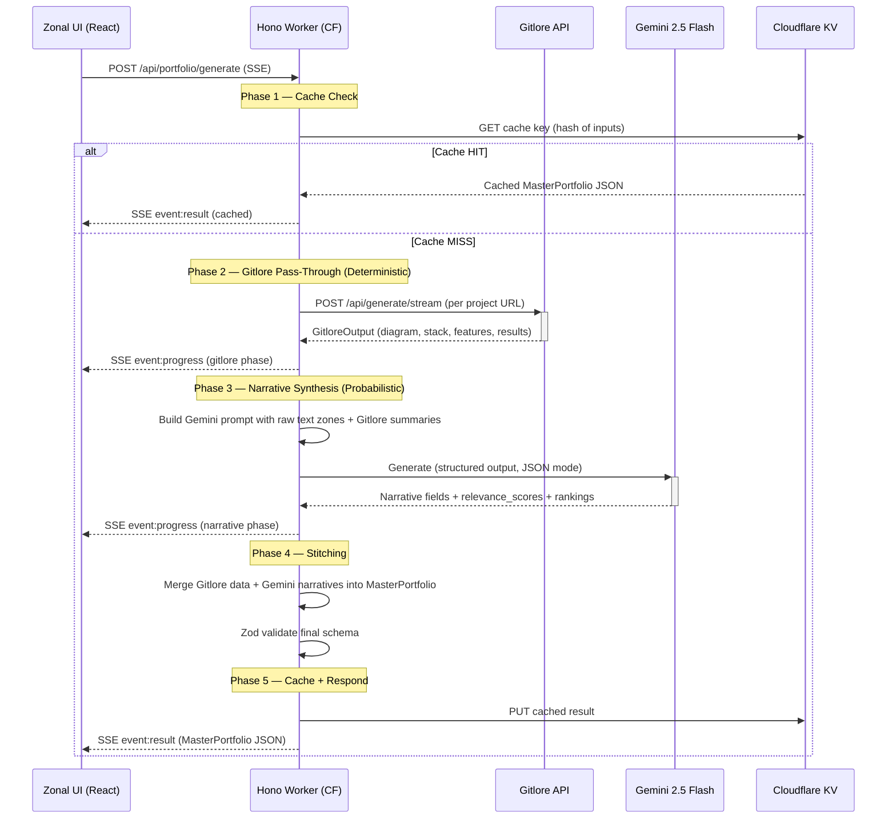
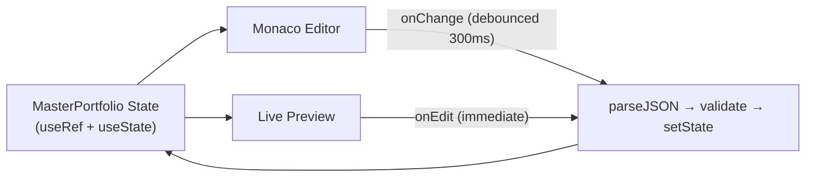

# ARCHITECTURE_MANIFEST.md — Refolio

> **The Headless Engineering Narrative Engine & Master Portfolio Orchestrator**
> Status: Architecture Phase (Antigrav-Ready) · Strictly No Code · Plan Only

---

## 1. Project Structure

Refolio is a **pnpm monorepo** mirroring Gitlore's proven layout with two packages.

```
refolio/
├── package.json              # Root: scripts, pnpm workspace
├── pnpm-workspace.yaml       # packages: ["packages/*"]
├── packages/
│   ├── api/                  # Hono Worker → Cloudflare Workers
│   │   ├── src/
│   │   │   ├── index.ts              # Hono app, CORS, error handler, route mount
│   │   │   ├── routes/
│   │   │   │   └── portfolio.ts      # POST /api/portfolio/generate (SSE streaming)
│   │   │   ├── modules/
│   │   │   │   ├── gitlore/          # Deterministic pass-through client
│   │   │   │   │   └── client.ts     # Fetch from live Gitlore API
│   │   │   │   ├── narrative/        # Gemini AI narrative synthesis
│   │   │   │   │   ├── gemini.ts     # Gemini 2.5 Flash client (structured output)
│   │   │   │   │   └── prompt.ts     # System + User prompt builders
│   │   │   │   ├── ranking/          # Relevance scoring module
│   │   │   │   │   └── scorer.ts     # Heuristic ranking logic
│   │   │   │   ├── stitcher/         # JSON assembly (merge deterministic + probabilistic)
│   │   │   │   │   └── merge.ts      # Final MasterPortfolio assembly
│   │   │   │   └── validation/       # Zod schema enforcement
│   │   │   │       └── schema.ts     # MasterPortfolio Zod schema
│   │   │   ├── lib/
│   │   │   │   ├── config.ts         # Bindings type, getConfig()
│   │   │   │   ├── errors.ts         # RefolioError class + factory
│   │   │   │   ├── progress.ts       # SSE ProgressCallback type
│   │   │   │   └── cache.ts          # Cloudflare KV caching layer
│   │   │   └── schemas/
│   │   │       ├── request.ts        # Inbound request Zod schema
│   │   │       └── response.ts       # MasterPortfolio Zod schema (shared)
│   │   ├── wrangler.toml
│   │   ├── tsconfig.json
│   │   └── package.json
│   │
│   └── web/                  # Vite + React 19 → Cloudflare Pages
│       ├── src/
│       │   ├── main.tsx              # Entry: StrictMode → ThemeProvider → App
│       │   ├── App.tsx               # Zonal split-pane layout
│       │   ├── index.css             # Gitlore Design DNA tokens (extracted)
│       │   ├── components/
│       │   │   ├── layout/           # Header, Footer (theme toggle)
│       │   │   ├── input/            # Zonal input forms (Identity, Hustle, Credentials, Gitlore Queue)
│       │   │   ├── preview/          # Live Preview with HoverCard states
│       │   │   ├── editor/           # Monaco JSON editor wrapper
│       │   │   ├── output/           # OutputTabs (Preview | JSON toggle)
│       │   │   ├── progress/         # SSE ProgressFeed (modal + docked)
│       │   │   └── sort/             # Sort toggles (Rank, Date, Category)
│       │   ├── lib/
│       │   │   ├── api.ts            # SSE streaming client (Hono RPC)
│       │   │   ├── theme.tsx         # ThemeProvider (Dark/Light/System)
│       │   │   ├── sync.ts           # Two-way Monaco ↔ Preview sync engine
│       │   │   └── store.ts          # MasterPortfolio state container
│       │   └── types/
│       │       └── portfolio.ts      # Frontend type mirrors of Zod schemas
│       ├── index.html
│       ├── vite.config.ts
│       ├── wrangler.toml
│       ├── tsconfig.json
│       └── package.json
└── ../gitlore/               # Sibling: READ-ONLY reference for Design DNA
```

---

## 2. The "Antigrav" Style Extraction Plan

### 2.1 Source of Truth: Gitlore's Design DNA

The following tokens were extracted from `gitlore/web/src/index.css`:

| Category | Light Mode | Dark Mode |
|---|---|---|
| `--color-bg` | `#fafafa` | `#09090b` |
| `--color-bg-secondary` | `#f4f4f5` | `#18181b` |
| `--color-bg-tertiary` | `#e4e4e7` | `#27272a` |
| `--color-surface` | `#ffffff` | `#18181b` |
| `--color-surface-hover` | `#f9fafb` | `#1f1f23` |
| `--color-border` | `#e4e4e7` | `#27272a` |
| `--color-border-focus` | `#a1a1aa` | `#52525b` |
| `--color-text` | `#18181b` | `#fafafa` |
| `--color-text-secondary` | `#52525b` | `#a1a1aa` |
| `--color-text-muted` | `#a1a1aa` | `#52525b` |
| `--color-accent` | `#6d28d9` (violet-700) | `#8b5cf6` (violet-500) |
| `--color-accent-hover` | `#7c3aed` | `#a78bfa` |

### 2.2 Extraction Strategy

1. **Copy `index.css` verbatim** from Gitlore as the baseline design system
2. **Extend** with Refolio-specific semantic tokens (e.g., `--color-rank-high`, `--color-rank-low`)
3. **Preserve** all existing utility classes: `.bg-grid-pattern`, `.animate-fade-up`, `.animate-fade-in`, JSON syntax highlighting classes
4. **Typography**: `Inter` (sans), `JetBrains Mono` (mono) — identical to Gitlore
5. **Radii**: `--radius-sm` through `--radius-2xl` (0.375rem → 1.25rem) — carried over
6. **Animations**: Same `cubic-bezier(0.16, 1, 0.3, 1)` easing curve throughout

### 2.3 Theme Provider (Direct Port)

Port `gitlore/web/src/lib/theme.tsx` with one change:
- Replace `localStorage.getItem("gitlore-theme")` → `localStorage.getItem("refolio-theme")`
- Same `ThemeContext` pattern: `{ theme, resolved, setTheme }`
- Same `@custom-variant dark (&:where(.dark, .dark *))` Tailwind v4 strategy
- Same `.dark` class toggle on `document.documentElement`

### 2.4 Component Pattern Parity

| Gitlore Pattern | Refolio Equivalent |
|---|---|
| `Header.tsx` — sticky blur header, theme dropdown | Identical structure, rebrand to "Refolio" |
| `OutputTabs.tsx` — tab bar with accent underline | Reuse pattern for Preview \| JSON tabs |
| `ProgressFeed.tsx` — phased SSE log viewer | Extend with additional phases (narrative, ranking) |
| `JsonView.tsx` — layered textarea + syntax highlight | Replace with `@monaco-editor/react` for full editing |
| `DefaultLayout.tsx` — bento card grid | Adapt as Live Preview component with HoverCard states |

### 2.5 Tailwind v4 Configuration

Identical to Gitlore — uses `@tailwindcss/vite` plugin v4 with CSS-first `@theme` blocks. **No `tailwind.config.ts` file** needed.

---

## 3. The Data Contract — `MasterPortfolio` Zod Schema

> This is the **single source of truth** governing the Hono RPC response, Gemini's structured output target, and the Monaco editor's live-editing contract.

```
MasterPortfolio {
  profile: {
    name: string
    role: string                       // e.g., "Full-Stack Engineer"
    contact: {
      email: string
      github: string (URL)
      linkedin?: string (URL)
      website?: string (URL)
    }
    philosophy?: string                // 1-2 sentence engineering philosophy
  }

  rankings: {
    generated_at: string (ISO date)
    strategy: "hirer_relevance"
    ordered_ids: string[]              // Sorted item IDs by relevance_score descending
  }

  achievements: Array<{
    id: string (nanoid)
    title: string
    description: string
    date?: string
    verifiable: boolean
    evidence_url?: string
    relevance_score: number (0-100)    // LLM-assigned
  }>

  solutions: Array<{
    id: string (nanoid)
    title: string
    one_liner: string
    contributions: string              // Polished role titles (from Gemini)
    problem: string
    goal: string
    key_features: Array<{ icon: string, text: string }>
    architecture_diagram_code: string  // Mermaid.js (from Gitlore, bypasses LLM)
    tech_stack: Array<{ name: string, role: "Primary" | "Supporting" | "Infrastructure" }>
    stack_reason: string
    results: {
      performance: { icon: string, text: string }
      scale: { icon: string, text: string }
      utility: { icon: string, text: string }
    }
    links: Array<{ icon: string, label: string, url: string }>
    gallery: string[]
    source: "gitlore"                  // Provenance tag
    relevance_score: number (0-100)    // LLM-assigned
  }>

  credentials: Array<{
    id: string (nanoid)
    type: "education" | "certification"
    title: string
    institution: string
    date?: string
    description?: string
    relevance_score: number (0-100)    // LLM-assigned
  }>
}
```

### 3.1 Schema Boundaries

| Field Source | Provider | Token Cost |
|---|---|---|
| `solutions[].architecture_diagram_code` | **Gitlore API** (deterministic) | **Zero** — bypasses LLM |
| `solutions[].tech_stack` | **Gitlore API** (deterministic) | **Zero** |
| `solutions[].results` | **Gitlore API** (deterministic) | **Zero** |
| `solutions[].key_features` | **Gitlore API** (deterministic) | **Zero** |
| `solutions[].one_liner`, `problem`, `goal` | **Gitlore API** (deterministic) | **Zero** |
| `profile.philosophy` | **Gemini** (probabilistic) | Tokens consumed |
| `achievements[].description` | **Gemini** (probabilistic) | Tokens consumed |
| `rankings.ordered_ids` | **Gemini** (probabilistic) | Tokens consumed |
| `*.relevance_score` | **Gemini** (probabilistic) | Tokens consumed |
| `credentials[].description` | **Gemini** (probabilistic) | Tokens consumed |

---

## 4. Orchestration Flow — Single Generation Request



### 4.1 Step-by-Step Logic

| Step | Action | Provider | SSE Phase |
|---|---|---|---|
| 1 | Validate inbound request via `GenerateRequestSchema.safeParse()` | API logic | — |
| 2 | Check KV cache for identical input hash | Cloudflare KV | `cache` |
| 3 | For each project URL, call Gitlore's `/api/generate/stream` | Gitlore API | `gitlore` |
| 4 | Collect all `GitloreOutput` objects, strip `_thinking` if present | API logic | `gitlore` |
| 5 | Build Gemini prompt: inject raw text zones (Identity, Hustle, Credentials) + Gitlore summaries as context | API logic | `narrative` |
| 6 | Call Gemini 2.5 Flash with `response_format: { type: "json_object" }` and structured output schema | Gemini API | `narrative` |
| 7 | Parse Gemini response, extract `relevance_score` for each item, generate `rankings.ordered_ids` | API logic | `ranking` |
| 8 | **Stitch**: Merge deterministic Gitlore fields into `solutions[]`, Gemini narrative fields into profile/achievements/credentials | API logic | `stitching` |
| 9 | Validate merged `MasterPortfolio` via Zod | API logic | `validation` |
| 10 | Write to KV cache, stream final `result` SSE event | API logic | `result` |

### 4.2 Hybrid Boundary Definition

```
┌─────────────────────────────────────────────────────────────────┐
│                    DETERMINISTIC ZONE                           │
│                    (Gitlore API — Zero LLM tokens)              │
│                                                                 │
│  • architecture_diagram_code (Mermaid)                          │
│  • tech_stack (name + role)                                     │
│  • key_features (icon + text)                                   │
│  • results (performance, scale, utility)                        │
│  • one_liner, problem, goal, stack_reason                       │
│  • links (GitHub URL + custom)                                  │
├─────────────────────────────────────────────────────────────────┤
│                    PROBABILISTIC ZONE                           │
│                    (Gemini 2.5 Flash — Token-consuming)          │
│                                                                 │
│  • profile.philosophy (synthesized from raw text)               │
│  • achievements[].description (polished narratives)             │
│  • credentials[].description (contextualized)                   │
│  • ALL relevance_score values (0-100)                           │
│  • rankings.ordered_ids (sorted by score)                       │
│  • solutions[].contributions (role title synthesis)             │
└─────────────────────────────────────────────────────────────────┘
```

---

## 5. Ranking Logic Specification

### 5.1 Heuristic Definition

The LLM (Gemini 2.5 Flash) will assign `relevance_score` (0–100) using a **weighted multi-signal heuristic** embedded in the system prompt:

| Signal | Weight | Description |
|---|---|---|
| **Technical Complexity** | 30% | Depth of architecture (microservices > static sites), novel algorithms, system design patterns |
| **Impact & Scale** | 25% | User-facing metrics, production deployment, user count, performance improvements |
| **Verifiability** | 20% | Presence of live URLs, GitHub repos, public evidence, certifications from recognized bodies |
| **Recency** | 15% | More recent work scores higher (decay function on date) |
| **Narrative Strength** | 10% | How compelling the problem→solution story is for a hiring manager |

### 5.2 Prompt Injection Strategy

The scoring rubric will be embedded in the Gemini system prompt as a structured instruction block. The LLM returns scores as part of the JSON structured output — **not** computed post-hoc. This ensures the LLM can reason holistically across all items before assigning relative scores.

### 5.3 Sort Application

```
rankings.ordered_ids = ALL item IDs sorted by relevance_score DESC
```

The frontend applies this ordering via `Array.sort()` keyed on the `ordered_ids` array index. Sort toggles (Rank, Date, Category) re-sort client-side without re-calling the API.

---

## 6. State Management Strategy — Two-Way Sync

### 6.1 The Problem

Monaco Editor ↔ Live Preview must stay in sync **bidirectionally** without:
- Race conditions (simultaneous edits from both sides)
- Flicker (re-renders cascading through React tree)
- Stale closures (ref-based values diverging from state)

### 6.2 Architecture: Single Authoritative State + Debounced Propagation



**Core Principle**: There is exactly **one** authoritative `MasterPortfolio` object held in a `useRef` (for synchronous access) mirrored by a `useState` (for React rendering).

### 6.3 Implementation Strategy

| Concern | Solution |
|---|---|
| **Monaco → Preview** | Monaco `onChange` fires on every keystroke. Debounce 300ms → `JSON.parse()` → Zod `safeParse()` → if valid, update state. Invalid JSON shows inline error banner (like Gitlore's `JsonView`), preview holds last-valid state. |
| **Preview → Monaco** | Direct field edits (e.g., HoverCard inline edit) call `setState` immediately → `useEffect` serializes to `JSON.stringify(data, null, 2)` → pushes to Monaco via controlled `value` prop. |
| **Conflict resolution** | Last-write-wins. A `generationId` counter increments on each state write. Stale debounced writes (where `generationId` has moved on) are silently discarded. |
| **Flicker prevention** | Use `React.memo()` on Preview sub-components with shallow equality checks. Monaco updates via `editor.setValue()` only when the serialized JSON actually differs (string equality check). |
| **Layout animations** | Framer Motion `<AnimatePresence>` + `<LayoutGroup>` on sortable card lists. Sort changes trigger `layout` animations, not full unmount/remount. |

### 6.4 Data Flow Diagram

```
User types in Monaco
  → 300ms debounce
  → JSON.parse()
  → Zod safeParse()
  → ✅ valid: masterPortfolioRef.current = parsed; setPortfolio(parsed)
  → ❌ invalid: setJsonError(err.message) — preview holds stale state

User edits in Preview (e.g., clicks to edit a title)
  → Immediate: setPortfolio({...prev, solutions: [...modified]})
  → useEffect: monacoRef.current.setValue(JSON.stringify(portfolio, null, 2))
```

---

## 7. Deployment Roadmap

### 7.1 Monorepo Configuration

```yaml
# pnpm-workspace.yaml
packages:
  - "packages/*"
```

```json
// Root package.json scripts
{
  "dev": "pnpm --parallel -r run dev",
  "dev:api": "pnpm --filter @refolio/api run dev",
  "dev:web": "pnpm --filter @refolio/web run dev",
  "deploy": "pnpm -r run deploy",
  "deploy:api": "pnpm --filter @refolio/api run deploy",
  "deploy:web": "pnpm --filter @refolio/web run deploy",
  "typecheck": "pnpm -r run typecheck"
}
```

### 7.2 API Worker (Cloudflare Workers)

```toml
# packages/api/wrangler.toml
name = "refolio-api"
main = "src/index.ts"
compatibility_date = "2025-04-01"
compatibility_flags = ["nodejs_compat"]

[observability]
enabled = true

[vars]
GITLORE_API_URL = "https://api.gitlore.workers.dev"

# Secrets (via `wrangler secret put`):
# GEMINI_API_KEY

[[kv_namespaces]]
binding = "PORTFOLIO_CACHE"
id = "<KV_NAMESPACE_ID>"
```

**Dependencies**: `hono`, `zod`, `zod-to-json-schema`

### 7.3 Web Frontend (Cloudflare Pages)

```toml
# packages/web/wrangler.toml
name = "refolio-web"
compatibility_date = "2025-04-01"

[assets]
directory = "./dist"
not_found_handling = "single-page-application"
```

**Dependencies**: `react`, `react-dom`, `lucide-react`, `framer-motion`, `@monaco-editor/react`, `mermaid`
**Dev Dependencies**: `@tailwindcss/vite`, `tailwindcss`, `@vitejs/plugin-react`, `vite`, `typescript`, `wrangler`, `@types/react`, `@types/react-dom`

### 7.4 Environment Variables

| Variable | Location | Purpose |
|---|---|---|
| `GEMINI_API_KEY` | API secret | Gemini 2.5 Flash authentication |
| `GITLORE_API_URL` | API var | Gitlore endpoint for deterministic pass-through |
| `PORTFOLIO_CACHE` | API KV binding | Cloudflare KV namespace for caching |
| `VITE_API_URL` | Web `.env` | Refolio API endpoint URL |

### 7.5 CI/CD Flow

1. Push to `main` → Cloudflare Pages auto-deploys `packages/web`
2. `pnpm deploy:api` → Wrangler deploys Hono worker
3. Dev: `wrangler dev` (API on `:8787`) + `pnpm dev` (Web on `:5173`)

---

## 8. Hybrid Thrift Strategy — Confirmation

> **I confirm full understanding of the Hybrid Thrift Strategy.**

The strategy is:

1. **Gitlore handles all code-derived data** — architecture diagrams, tech stacks, features, results, problem/goal narratives. These are **already generated** by Cerebras/Llama via the existing Gitlore pipeline. Refolio consumes them via HTTP, spending **zero additional LLM tokens**.

2. **Gemini handles only what Gitlore cannot** — human narrative synthesis (philosophy, achievement descriptions), cross-item relevance scoring, and contribution role polishing. This is the **minimal surface area** requiring probabilistic inference.

3. **KV caching eliminates redundant calls** — identical input hashes return cached `MasterPortfolio` JSON instantly, preventing both Gitlore API calls and Gemini token consumption on repeat visits.

4. **Structured output mode** — Gemini returns JSON matching the Zod schema directly, eliminating post-processing token waste from markdown/prose generation.

The net effect: **maximum narrative quality at minimum token expenditure**, with deterministic data never touching the LLM context window.
